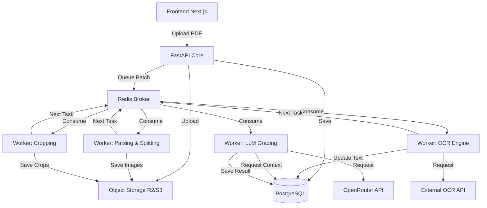

# medquestcorrector - Architecture

## Visão Geral

O medquestcorrector é projetado como uma **plataforma orientada a eventos/workers**. O processamento de PDFs, extração de imagens, OCR e chamadas para LLM são operações intensivas em I/O e sujeitas a falhas/rate-limits. Para garantir a confiabilidade, a arquitetura desvincula a ingestão dos dados de sua análise através de filas.

## Fluxo Principal (Fim-a-Fim)

1. **Front-end:** Interage via chamadas RESTful (síncronas) para enviar PDFs e gerenciar cadastros.
2. **Object Storage:** Recebe o arquivo PDF e devolve uma chave/ID.
3. **API (Síncrona):** Confirma a recepção do arquivo, salva no banco e enfileira um evento na Fila.
4. **Workers Assíncronos (Celery/Redis):** Processam as etapas em pipeline:
   - **Worker 1 (Ingestão/Parsing):** Renderiza páginas, detecta QR Codes/cabeçalhos e agrupa as folhas de uma prova.
   - **Worker 2 (Segmentação/Visão):** Com base no template oficial, recorta os bounding boxes de cada resposta e salva as sub-imagens (crops) no Storage.
   - **Worker 3 (OCR):** Processa apenas os recortes e retorna o texto transcrito.
   - **Worker 4 (Correção IA):** Aciona o modelo via OpenRouter com base no contexto (Enunciado + Rubrica + Texto OCR).
5. **Front-end:** Realiza *polling* (ou aguarda WebSockets) para atualizar o progresso até a conclusão para a revisão humana.

## Módulos do Sistema

### 1. Core API (Backend Principal)
- **Tecnologias:** Python 3.12, FastAPI, SQLAlchemy, PostgreSQL.
- **Responsabilidades:** 
  - CRUD (Auth, Usuários, Templates, Provas, Rubricas).
  - Recepção e orquestração dos uploads.
  - Disponibilizar dados consolidados para revisão e relatórios.

### 2. Frontend
- **Tecnologias:** Next.js (App Router), React, TypeScript, Tailwind CSS, Shadcn UI.
- **Responsabilidades:** 
  - Painel do professor para cadastro de provas.
  - Tela de revisão otimizada (imagem vs. transcrição vs. nota da IA).

### 3. Pipeline de Processamento (Workers)
- **Ingestão e Agrupamento:** Utiliza `PyMuPDF (fitz)` e `pdf2image` para fatiar o PDF.
- **Segmentação (OpenCV):** Aplica o recorte exato nas posições pré-estabelecidas do gabarito.
- **OCR Provider:** Componente agnóstico (`AzureOCRProvider` recomendado) para extração confiável de manuscritos.
- **LLM Provider:** Módulo estruturado de prompt via OpenRouter.

## Diagrama Lógico Macro

## Diretrizes e Decisões Críticas
- **Templates Rígidos:** A extração só será baseada em templates gerados pelo sistema, evitando _layout mapping_ complexo.
- **Isolamento da IA:** A IA nunca recebe a imagem total do PDF; processa apenas a representação estruturada via texto.
- **Resiliência:** Retries automáticos e idempotência em cada camada do Worker.
